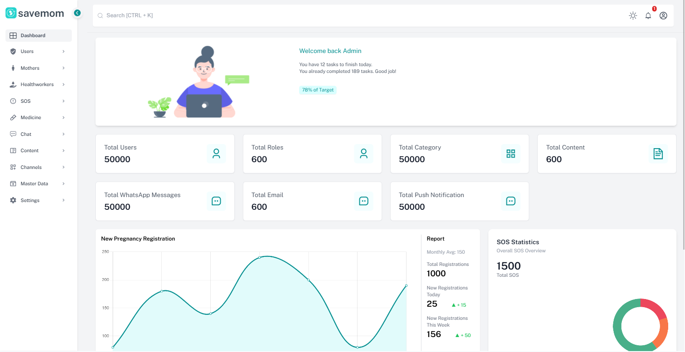

# SaveMom Admin Dashboard

A responsive, accessible, and interactive **Admin Dashboard** for managing users, roles, content, SOS alerts, and analytics — designed for the **SaveMom** platform. Built with **React**, **Tailwind CSS**, and **Chart.js**.

---

## 📸 Preview



---

## 🚀 Features

- Responsive sidebar navigation with collapsible menu
- Dynamic KPI cards section
- Line and Donut charts using `react-chartjs-2`
- Welcome message and performance tracker
- SOS statistics with priority levels
- Fully responsive layout with Tailwind CSS
- Icon integration via `react-icons`

---

## 🛠️ Tech Stack

| Tool         | Purpose                     |
| ------------ | --------------------------- |
| React        | UI rendering                |
| Tailwind CSS | Utility-first CSS styling   |
| Chart.js     | Data visualization          |
| React Icons  | Icon support                |
| Vite         | Development & build tooling |

---

## 📁 Folder Structure

```bash
.
├── public/                      # Static assets (favicon, etc.)
├── src/
│   ├── assets/                 # Images and brand visuals
│   ├── components/
│   │   ├── Header.jsx          # Top navigation bar
│   │   ├── Sidebar.jsx         # Side navigation with collapse
│   │   ├── WelcomeSection.jsx  # Welcome user panel
│   │   ├── KpiCardsSection.jsx # Dashboard KPIs
│   │   └── PregnancyRegistrationSection.jsx # Charts & SOS
│   ├── App.jsx                 # Main component rendering all sections
│   └── main.jsx                # Entry point
├── tailwind.config.js          # Tailwind CSS config
├── package.json                # Project dependencies
└── README.md                   # This file
```
